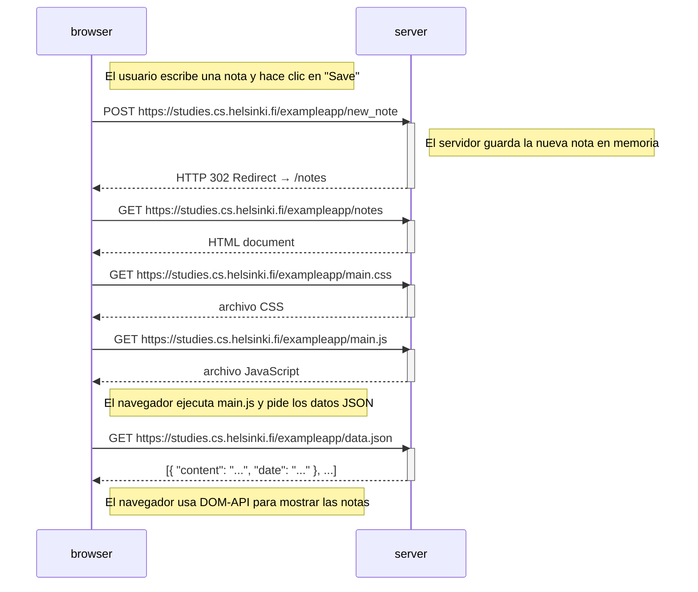
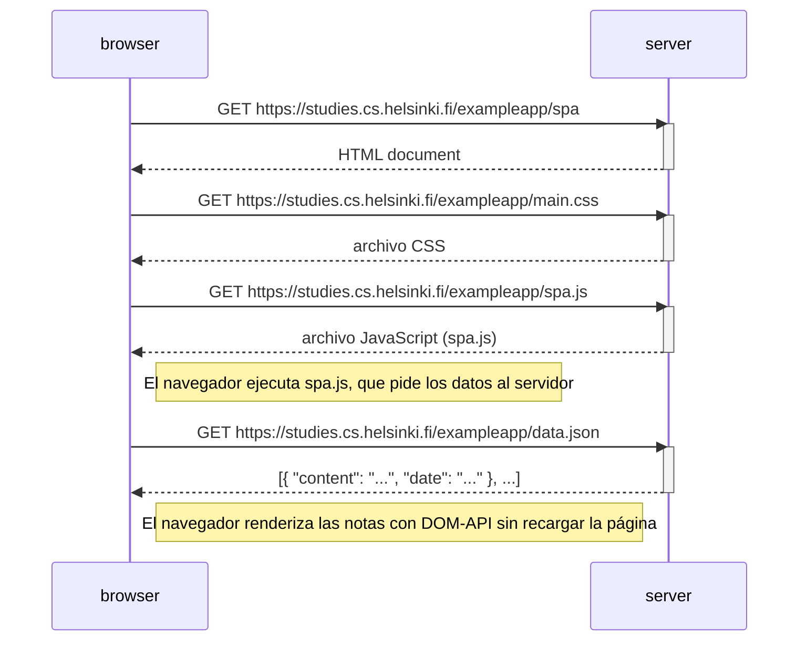
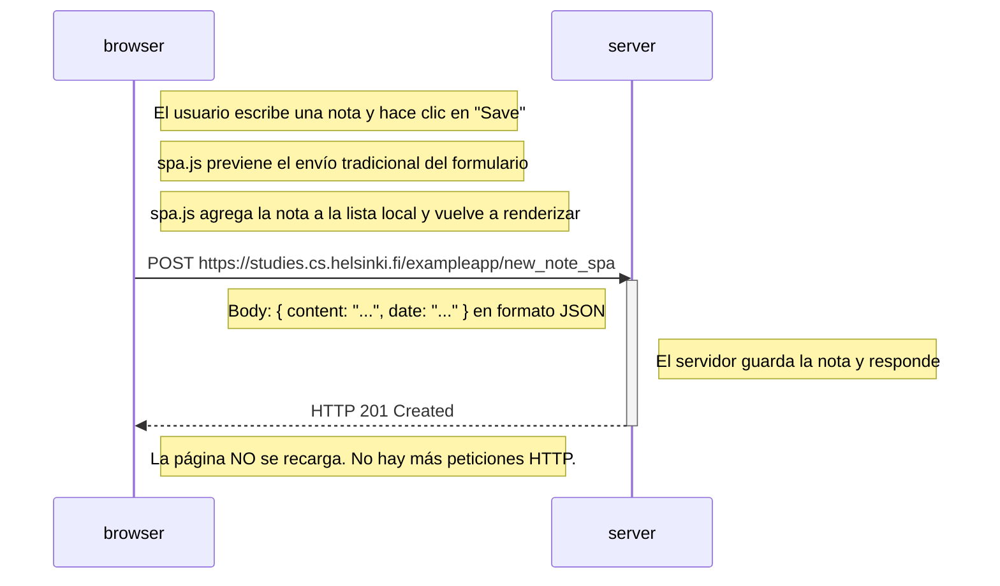

# Parte 0 - Ejercicios

## Ejercicio 0.4 — Nueva nota en app tradicional

```mermaid
sequenceDiagram
    participant browser
    participant server

    Note right of browser: El usuario escribe una nota y hace clic en "Save"

    browser->>server: POST https://studies.cs.helsinki.fi/exampleapp/new_note
    activate server
    Note right of server: El servidor guarda la nueva nota en memoria
    server-->>browser: HTTP 302 Redirect → /notes
    deactivate server

    browser->>server: GET https://studies.cs.helsinki.fi/exampleapp/notes
    activate server
    server-->>browser: HTML document
    deactivate server

    browser->>server: GET https://studies.cs.helsinki.fi/exampleapp/main.css
    activate server
    server-->>browser: archivo CSS
    deactivate server

    browser->>server: GET https://studies.cs.helsinki.fi/exampleapp/main.js
    activate server
    server-->>browser: archivo JavaScript
    deactivate server

    Note right of browser: El navegador ejecuta main.js y pide los datos JSON

    browser->>server: GET https://studies.cs.helsinki.fi/exampleapp/data.json
    activate server
    server-->>browser: [{ "content": "...", "date": "..." }, ...]
    deactivate server

    Note right of browser: El navegador usa DOM-API para mostrar las notas
```

## Ejercicio 0.5 — Abrir la versión SPA

```mermaid
sequenceDiagram
    participant browser
    participant server

    browser->>server: GET https://studies.cs.helsinki.fi/exampleapp/spa
    activate server
    server-->>browser: HTML document
    deactivate server

    browser->>server: GET https://studies.cs.helsinki.fi/exampleapp/main.css
    activate server
    server-->>browser: archivo CSS
    deactivate server

    browser->>server: GET https://studies.cs.helsinki.fi/exampleapp/spa.js
    activate server
    server-->>browser: archivo JavaScript (spa.js)
    deactivate server

    Note right of browser: El navegador ejecuta spa.js, que pide los datos al servidor

    browser->>server: GET https://studies.cs.helsinki.fi/exampleapp/data.json
    activate server
    server-->>browser: [{ "content": "...", "date": "..." }, ...]
    deactivate server

    Note right of browser: El navegador renderiza las notas con DOM-API sin recargar la página
```

## Ejercicio 0.6 — Nueva nota en versión SPA

```mermaid
sequenceDiagram
    participant browser
    participant server

    Note right of browser: El usuario escribe una nota y hace clic en "Save"
    Note right of browser: spa.js previene el envío tradicional del formulario
    Note right of browser: spa.js agrega la nota a la lista local y vuelve a renderizar

    browser->>server: POST https://studies.cs.helsinki.fi/exampleapp/new_note_spa
    activate server
    Note left of server: Body: { content: "...", date: "..." } en formato JSON
    Note right of server: El servidor guarda la nota y responde
    server-->>browser: HTTP 201 Created
    deactivate server

    Note right of browser: La página NO se recarga. No hay más peticiones HTTP.
```
